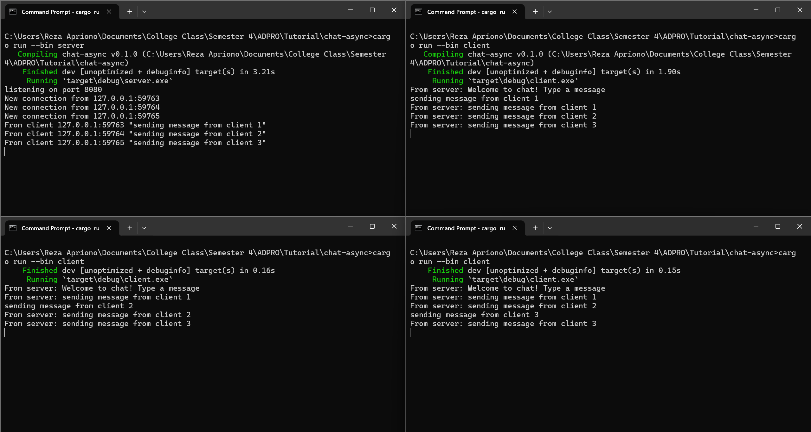

# 2.1 Original code of broadcast chat.


Dari screenshot tersebut, terlihat bahwa 1 server dijalankan dengan menggunakan command `cargo run --bin server` dan 3 client dijalankan di 3 terminal berbeda menggunakan command `cargo run --bin client`. Server terhubung dengan ketiga client terlihat dari adanya 3 new connection yang tercetak pada terminal tempat server dijalankan. Masing-masing dari client juga mengirim pesan ke server. Dapat terlihat bahwa semua client dan juga server menerima pesan yang dikirim oleh masing-masing client tersebut. Hal ini terjadi karena setiap client mengetikkan pesan di terminal, maka server akan menerima pesan tersebut. Kemudian, server akan mengirimkannya ke semua client yang terkoneksi dengan server.

# 2.2 Modifying the websocket port.
Untuk mengubah port number menjadi 8080, diperlukan perubahan pada file `src/bin/server.rs` dan `src//bin/client.rs`

Pada awalnya kode berikut pada `src/bin/server.rs` seperti ini:
```rust
async fn main() -> Result<(), Box<dyn Error + Send + Sync>> {
    let (bcast_tx, _) = channel(16);

    let listener = TcpListener::bind("127.0.0.1:2000").await?;
    println!("listening on port 2000");
```

Diubah menjadi:
```rust
async fn main() -> Result<(), Box<dyn Error + Send + Sync>> {
    let (bcast_tx, _) = channel(16);

    let listener = TcpListener::bind("127.0.0.1:8080").await?;
    println!("listening on port 8080");
```

<br>

Pada awalnya kode berikut pada `src/client/.rs` seperti ini:
```rust
async fn main() -> Result<(), tokio_websockets::Error> {
    let (mut ws_stream, _) =
        ClientBuilder::from_uri(Uri::from_static("ws://127.0.0.1:2000"))
            .connect()
            .await?;
```

Diubah menjadi:
```rust
async fn main() -> Result<(), tokio_websockets::Error> {
    let (mut ws_stream, _) =
        ClientBuilder::from_uri(Uri::from_static("ws://127.0.0.1:8080"))
            .connect()
            .await?;
```


Berikut adalah screenshot saat menjalankan 1 server dan 3 client setelah melakukan perubahan pada port number

Dari screenshot tersebut, dapat terlihat bahwa selama client dan server memiliki port yang sama, maka program akan tetap berjalan dengan baik sama seperti sebelum port number diubah. Keduanya dapat berkomunikasi dengan baik karena pada kode server dan klien menggunakan protokol websocket yang sama, yang merupakan bagian dari library tokio_websockets.