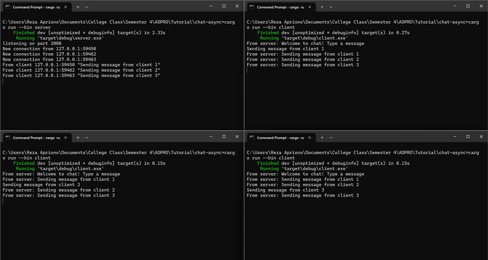

#  2.1 Original code of broadcast chat.

Dari screenshot tersebut, terlihat bahwa 1 server dijalankan dengan menggunakan command `cargo run --bin server` dan 3 client dijalankan di 3 terminal berbeda menggunakan command `cargo run --bin client`. Server terhubung dengan ketiga client terlihat dari adanya 3 new connection yang tercetak pada terminal tempat server dijalankan. Masing-masing dari client juga mengirim pesan ke server. Dapat terlihat bahwa semua client dan juga server menerima pesan yang dikirim oleh masing-masing client tersebut. Hal ini terjadi karena setiap client mengetikkan pesan di terminal, maka server akan menerima pesan tersebut. Kemudian, server akan mengirimkannya ke semua client yang terkoneksi dengan server.